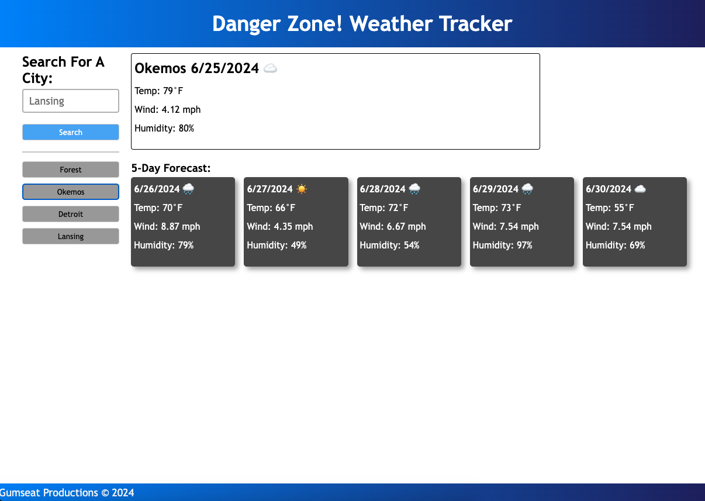

# Danger-Zone-Weather-Tracker

A basic weather checker app that displays the current forecast and the 5-day forecast for a specific city when searched.

## Usage

In the 'Search For A City' text entry field type in your local city name (or any of city of your choosing). The current weather conditions
for that city will then display to the right and the 5-day forecast will display below that. Previously searched cities will be displayed as
clickable buttons underneath the 'search' button so you can easily revisit the weather in those areas. 

## Acknowledgements

Assistance in creating this site and its function's was made possible primarily through Jung, W3 Schools, and all of the TA's.

## Visuals/Links

https://sdkwapis.github.io/Danger-Zone-Weather-Tracker/

## Contributing

Pull requests are welcome. For major changes, please open an issue first
to discuss what you would like to change.

Please make sure to update tests as appropriate.

